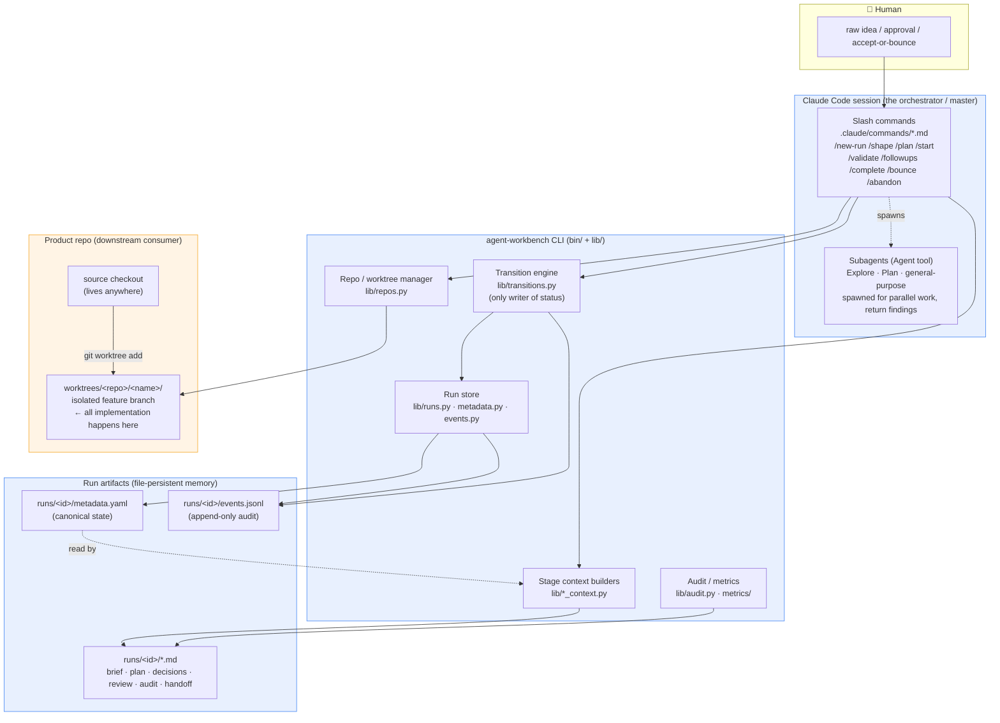
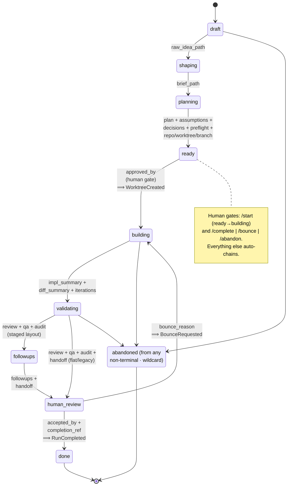
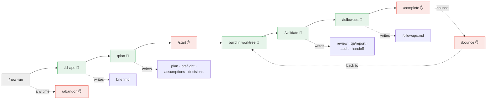

# Architecture diagram

Visual companion to [`architecture.md`](../architecture.md). That file is the prose
("why"); this file is the picture ("what talks to what"). Source of truth for the
lifecycle FSM is [`agent-workbench-live/schemas/transitions.yaml`](../agent-workbench-live/schemas/transitions.yaml).

## 1. System layers

How a human request flows down through the workbench and out into a product repo.
The workbench owns orchestration; the product repo only ever sees a finished feature branch.

**Reading it:** the human only touches the session. The session's slash commands
call the CLI. The transition engine is the *only* writer of `status` and the *only*
appender of `TransitionApplied` — that keeps lifecycle state single-threaded. Context
builders read `metadata.yaml` and emit markdown artifacts. The product repo never
imports the workbench; it just receives a worktree on a feature branch.

## 2. Lifecycle state machine

Exactly mirrors `schemas/transitions.yaml`. Solid arrows are the happy path; each
edge requires its listed **evidence** before the engine will apply it. `abandoned`
is reachable from *any* non-terminal state (wildcard). `done` and `abandoned` are
terminal and preserve all artifacts.

## 3. Slash command → stage → artifact mapping

Which command drives each transition, whether it carries an LLM, and what it writes.
LLM-bearing stages auto-chain (`/new-run → /shape → /plan`); the rest are thin
deterministic transitions plus the two human gates.

Legend: 🧠 LLM-bearing (Skill/subagents) · ✋ human gate · plain = deterministic plumbing.

## Cross-references

- Prose rationale & design goals — [`architecture.md`](../architecture.md)
- Lifecycle narrative — [`docs/lifecycle.md`](lifecycle.md)
- In-run discipline (who may write status, only-`draft`-asks-questions) — [`agent-workbench-live/AGENTS.md`](../agent-workbench-live/AGENTS.md)
- FSM source of truth — [`agent-workbench-live/schemas/transitions.yaml`](../agent-workbench-live/schemas/transitions.yaml)
- Context library index — [`agent-workbench-live/context/README.md`](../agent-workbench-live/context/README.md)
